# GitHub Workflows

This repository uses a multi-stage GitHub Actions workflow pipeline to ensure quality and reliability.

## Workflow Dependency Chain

```mermaid
graph TD
    A[📚 Deploy Documentation] --> B[🧪 CI Tests]
    B --> C[📦 Build and Test Package]
    C --> D[🚀 Publish to PyPI]
    
    A1[Push to main] --> A
    A2[Pull Request] --> A
    B1[Python 3.9-3.13] --> B
    C1[Build & Verify] --> C
    D1[Release Tag] --> D
```

## Workflow Details

### 1. 📚 Deploy Documentation (`docs.yml`)
**Triggers:** Push to main, Pull requests
**Purpose:** Builds and deploys Sphinx documentation to GitHub Pages

- Builds documentation with Hatch
- Deploys to GitHub Pages (main branch only)
- **Next:** Triggers CI Tests workflow

### 2. 🧪 CI Tests (`ci.yml`)  
**Triggers:** After documentation build completes successfully
**Purpose:** Runs comprehensive tests across multiple Python versions

- Tests on Python 3.9, 3.10, 3.11, 3.12, 3.13
- Runs full test suite with Hatch
- Builds and verifies package
- **Next:** Triggers Build and Test Package workflow

### 3. 📦 Build and Test Package (`python-package.yml`)
**Triggers:** After CI tests complete successfully, or on GitHub releases
**Purpose:** Comprehensive build, test, and publish pipeline

- **Code Build:** Builds project with Hatch
- **Linting:** Runs isort, black, flake8
- **Type Checking:** Runs mypy validation  
- **Unit Tests:** Executes full test suite
- **Package Build:** Creates wheel and sdist
- **Publish:** Uploads to PyPI (release only)

## Workflow Flow

1. **Developer pushes to main** or **creates PR**
2. **Documentation workflow starts** automatically
3. **If docs build succeeds** → **CI Tests start** automatically  
4. **If CI tests pass** → **Build and Package workflow starts** automatically
5. **If it's a release** → **Package is published to PyPI**

## Benefits of This Approach

✅ **Quality Assurance**: Each stage must pass before the next begins
✅ **Fast Feedback**: Docs build quickly, catching syntax errors early  
✅ **Comprehensive Testing**: Multi-version testing ensures compatibility
✅ **Safe Publishing**: Only releases trigger PyPI publication
✅ **Clear Status**: Workflow summaries show progress through the chain

## Manual Workflow Triggers

While workflows are chained, you can also trigger them manually:

- **Documentation**: Any push/PR automatically starts the chain
- **CI Tests**: Can run independently on push/PR
- **Build & Package**: Only runs after successful CI or on releases
- **PyPI Publish**: Only on GitHub releases

## Monitoring

Each workflow provides detailed summaries and status updates:
- 📊 Build status badges in README
- 📝 Step-by-step progress in GitHub Actions
- 🔍 Detailed logs for debugging
- ✅ Clear success/failure indicators
